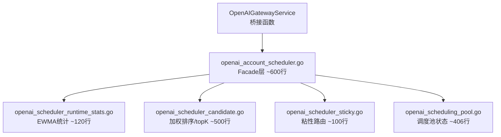

# sub2api 性能/调度重构与页面简约化计划

## 背景与目标

当前代码存在两个可量化的结构性问题：
- **后端调度器膨胀**: [openai_account_scheduler.go](backend/internal/service/openai_account_scheduler.go) 单文件 1573 行、62 个函数，耦合了 RuntimeStats（EWMA 统计）、CandidateScoring（加权堆排序/topK）、StickySession（粘性路由）、调度决策入口四个独立职责
- **前端页面臃肿**: [SettingsView.vue](frontend/src/views/admin/SettingsView.vue) 单文件 10,291 行（9 个 tab 全部内联），[AccountsView.vue](frontend/src/views/admin/AccountsView.vue) 2,892 行

策略：先发性能/调度版本（纯后端重构，无行为变化），观察一周稳定后再发页面简约化版本。

---

## 阶段一：调度器架构重构（v0.1.134.2）

### 目标

将 `openai_account_scheduler.go` 拆分为 4 个职责清晰的文件，保持所有外部接口（`OpenAIAccountScheduler` interface）和公共函数签名不变。

### 当前文件结构分析

```
openai_account_scheduler.go (1573行, 62 func)
├── RuntimeStats: EWMA 错误率/TTFT 统计、sync.Map、snapshot (行 150-250)
├── CandidateScoring: 加权堆排序、topK、LoadPlan、候选评分 (行 440-950)
├── StickySession: session hash 粘性选择 (行 343-440)
├── Facade: Select、buildSelectionOrder、ReportResult、Metrics (行 260-340, 950-1200)
├── SettingCache: 高级调度器开关缓存 (行 20-50)
└── GatewayService 桥接函数: SelectAccountWithScheduler 系列 (行 1293-1530)
```

### 拆分方案

#### Phase 1a: 提取 RuntimeStats → `openai_scheduler_runtime_stats.go`

提取内容：
- `openAIAccountRuntimeStats` struct + `loadOrCreate`、`report`、`snapshot`、`size` 方法
- `openAIAccountRuntimeStat` struct
- `updateEWMAAtomic` 辅助函数

约 120 行。零行为变更，纯文件移动。

#### Phase 1b: 提取 CandidateScoring → `openai_scheduler_candidate.go`

提取内容：
- `openAIAccountCandidateHeap` (Len/Less/Swap/Push/Pop)
- `buildOpenAIWeightedSelectionOrderByPriority`
- `selectTopKOpenAICandidates`
- `isOpenAIAccountCandidateBetter`
- `openAIAccountLoadPlan` struct
- `buildOpenAIAccountLoadPlan`、`buildOpenAISelectionOrder`
- `sortOpenAICompactRetryCandidates`
- `openAISelectionRNG`、`deriveOpenAISelectionSeed`

约 500 行。依赖 RuntimeStats 的 `snapshot` 方法通过参数传入，不直接引用 GatewayService。

#### Phase 1c: 提取 StickySession → `openai_scheduler_sticky.go`

提取内容：
- `selectBySessionHash` 方法（迁移到独立函数，接收候选列表参数）
- Session hash 计算、粘性命中逻辑

约 100 行。

#### Phase 1d: 重构 Facade → 保留原文件

原文件保留为薄 Facade 层，仅包含：
- `OpenAIAccountScheduler` interface 定义
- `defaultOpenAIAccountScheduler` struct + `Select`、`ReportResult`、`ReportSwitch`、`SnapshotMetrics`
- `OpenAIAccountScheduleRequest`、`OpenAIAccountScheduleDecision` 等类型定义
- `OpenAIGatewayService` 桥接函数（`SelectAccountWithScheduler` 系列）
- SettingCache 和高级调度器开关逻辑

约 600 行。

#### Phase 1e: 测试验证

```bash
go test ./internal/service -run "TestOpenAIAccountScheduler|TestOpenAIPathHealth|TestSelectAccountWithScheduler" -count=1
go test ./internal/service -run "^$" -count=1
go test ./internal/handler -run "^$" -count=1
```

### 架构图



### Phase 1f: 部署

- 提交（中文 commit message，按功能拆分）
- 构建不可变版本镜像 `sub2api:v0.1.134.2`
- 蓝绿部署验证
- 保留旧 active 作为回滚目标

---

## 阶段二：页面简约化（v0.1.134.3，一周后发布）

### Phase 2a: SettingsView 拆分

当前 [SettingsView.vue](frontend/src/views/admin/SettingsView.vue) 10,291 行，9 个 tab 全部内联。拆分方案：

**目标目录**: `frontend/src/views/admin/settings/`

| 新组件文件 | 对应 tab | 预估行数 | 从原文件提取行范围 |
|---|---|---|---|
| `GeneralSettingsTab.vue` | general | ~800 | L4780-5329 |
| `AgreementSettingsTab.vue` | agreement | ~500 | L5329-5531 |
| `FeaturesSettingsTab.vue` | features | ~900 | L5531-6053 |
| `SecuritySettingsTab.vue` | security | ~900 | L1191-2894 |
| `UsersSettingsTab.vue` | users | ~500 | L2894-3383 |
| `GatewaySettingsTab.vue` | gateway | ~1400 | L3383-4780 |
| `PaymentSettingsTab.vue` | payment | ~900 | L6053-6544 |
| `EmailSettingsTab.vue` | email | ~400 | L6544-6966 |
| `BackupSettingsTab.vue` | backup | 已提取 | L6966+ |

**当前进度（2026-06-18 Devil）**:
- General、Agreement、Features、Payment、Email、Security、Users、Gateway 已完成独立 tab 组件拆分。
- Backup 继续复用既有备份组件。
- `SettingsView.vue` 已收敛为 tab 容器，Gateway 只保留单个 `<GatewaySettingsTab />` 入口，加载、保存、OpenAI 路由策略和 Web Search 业务逻辑仍由父组件承载。

**拆分策略**:
- 每个 tab 组件接收 `modelValue` (当前设置对象) 和 `emit('update:modelValue')` 作为 props
- 共享状态（loading、saving、testingSmtp 等）由父组件通过 provide/inject 或 composable 传递
- 父组件 `SettingsView.vue` 缩减为 ~300 行的 Tab 路由容器

### Phase 2b: 布局与交互简化

- 低频设置项（如 SMTP 测试、Admin API Key 轮换）收起到折叠面板
- 统一 loading/error/empty 状态组件，减少每个 tab 内的重复样板
- 表单验证反馈统一使用 inline 提示而非 toast

### Phase 2c: AccountsView 拆分

当前 [AccountsView.vue](frontend/src/views/admin/AccountsView.vue) 2,892 行。

**提取子组件**:
- `AccountTableFilters.vue` — 筛选栏（已有引用，确认是否独立文件）
- `AccountBulkActions.vue` — 批量操作下拉
- `AccountAutoRefreshControl.vue` — 自动刷新控制
- `AccountOAuthDialog.vue` — OAuth 授权弹窗
- `AccountBatchTestModal.vue` — 批量测试弹窗

### Phase 2d: 其他页面拆分

- `UsersView.vue` (300行) → 提取 UserFormDialog、UserDetailDrawer
- `GroupsView.vue` (296行) → 提取 GroupFormDialog、GroupRateConfig
- `RiskControlView.vue` (253行) → 提取 RiskRuleEditor、RiskEventLog

### Phase 2e: 统一公共组件

在 `frontend/src/components/common/` 下补充：

| 组件 | 用途 |
|---|---|
| `LoadingSpinner.vue` | 统一加载态（替换各处自写 spinner） |
| `ErrorState.vue` | 错误态展示 + 重试按钮 |
| `EmptyState.vue` | 空数据态展示 |
| `ConfirmActionDialog.vue` | 危险操作确认弹窗 |

### Phase 2f: 验证与部署

```bash
npm run typecheck
npm run build
npm run test
```

---

## 风险与回滚

| 风险 | 影响 | 回滚方式 |
|---|---|---|
| 调度器拆分引入编译错误 | Go 编译失败 | 切回 v0.1.134.1 镜像 |
| 调度器拆分改变运行时行为 | OpenAI /responses 调度异常 | 立即切回旧 active 容器 |
| SettingsView 拆分遗漏状态 | 设置保存失败 | 前端回滚到旧构建 |
| SettingsView 拆分后类型错误 | typecheck 失败 | 不发布，修复后重建 |

**回滚目标**: 阶段一回滚到 `sub2api:v0.1.134.1`；阶段二回滚到阶段一发布的版本。

---

## 版本规划

| 版本 | 内容 | 镜像标签 |
|---|---|---|
| v0.1.134.2 | 调度器拆分（纯重构） | `sub2api:v0.1.134.2` |
| v0.1.134.3 | 页面简约化 | `sub2api:v0.1.134.3` |
